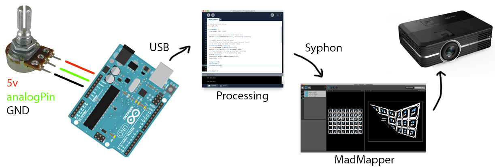
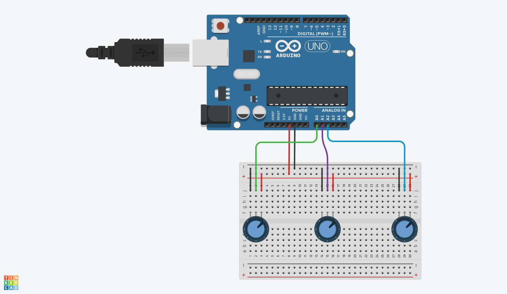
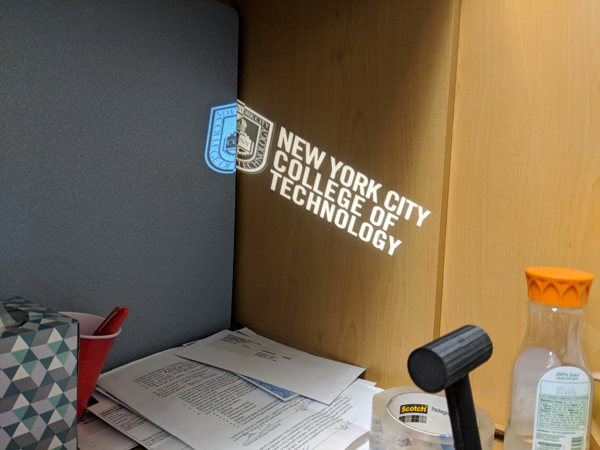
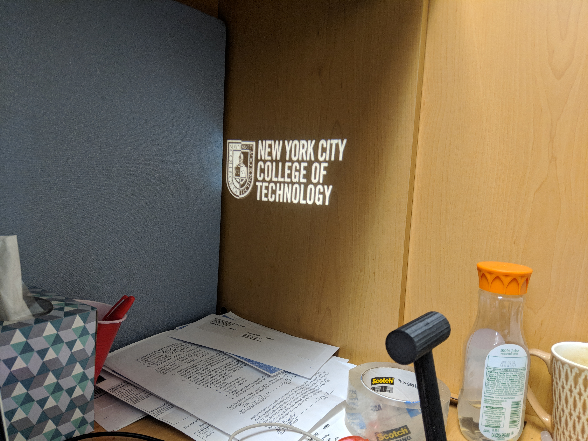

# Physical Computing / Projection Mapping

## Goal

Use an Arduino -> Processing/Unity -> Projection Mapping exercise as an interesting way to explore the signal chain that moves from hardware components to high level software.

## Demo

+ Projection mapping boxes based on potentiometer values
	+ [processing code](processing/colorbox_3x)
	+ [arduino code](arduino/potentiometer3x)

Signal flow:

1. Potentiometer
	+ Turned by the user, changing the output voltage on the middle pin.
2. Arduino
	+ Senses the potentiometer middle pin. Allows you to measure the voltage as a number between 0 -> 1023.
	+ Using Serial communication, you can output values from Arduino to Processing.
3. Processing (or Unity)
	+ Using Serial communication, you can input values from Arduino. You can then use these values to create audiovisual output.
	+ Optionally, if you would like to use projection mapping, you can use Syphon to publish the visual output of your Processing sketch to other applications.
4. MadMapper
	+ Allows you to use video sources (including Syphon) and warp them to match the geometry of a room or set of objects.

Wiring:

## Relevant Work

+ ["Interconnection" Projection Mapping](https://vimeo.com/184283369)
+ ["Box" Projection Mapping](https://www.youtube.com/watch?v=lX6JcybgDFo)
+ [Jenny Holzer](http://massmoca.org/event/jenny-holzer-projections/)
+ [The Illuminator](http://theilluminator.org/wheelofjustice/)
	+ [Stomp the Ban 1](https://www.picoku.net/media/1628607378273750372_3213066380)
	+ [Stomp the Ban 2](https://www.picoku.net/media/1628298497881830367_295652871)

## Projection Mapping

+ What is its purpose?
+ What can it do?

+ [Commercial example - Adidas](https://vani.sh/works/adidas/)
+ [Light the Way](https://vimeo.com/139242399)

## Potentiometers as Controllers

+ [WURM](http://graysonearle.com/wurm/)
	+ [processing code](processing/wurm_demomode)
	+ [arduino code](arduino/potentiometer1x)
+ Within Unity
	+ [unity code](Unity/Assets)
	+ [arduino code](arduino/potentiometer3x-smooth)
+ Alternative sensors
	+ Gyro/accelerometer
		+ [unity code](Unity/Assets)
		+ [arduino code](arduino/gyro/gyro.ino)

## Processing -> MadMapper via Syphon

+ Syphon works a bit like a serial connection, but for video. I.e., it can send video from one application to another. It can even do so over a network with [UDPsyphon](http://techlife.sg/UDPSyphon/)!

+ Syphon is MacOS only, but there are alternatives such as [Spout](http://spout.zeal.co/) for Windows.

## Putting it all Together

+ Knob Mapping
+ Ideas?

## Bonus demo

+ Extreme Unity projection mapping
