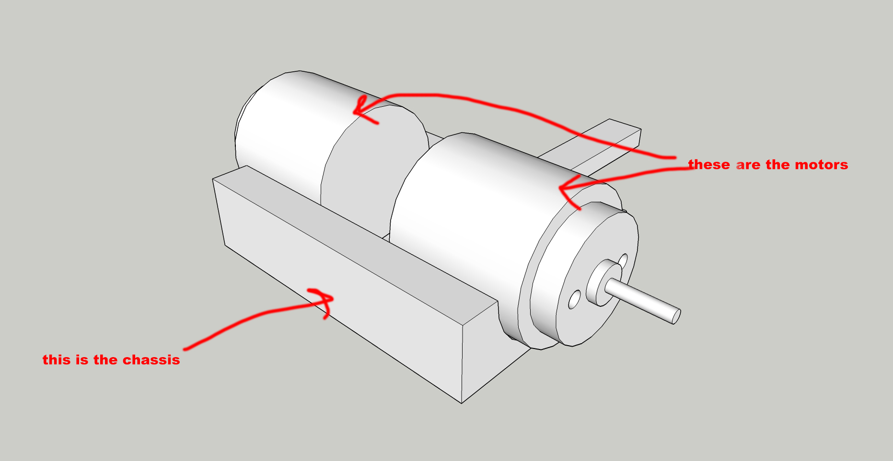
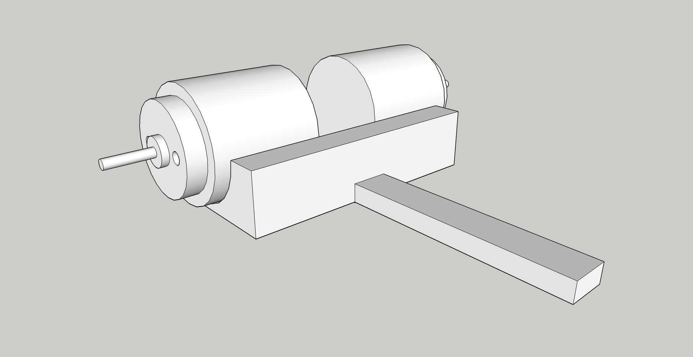
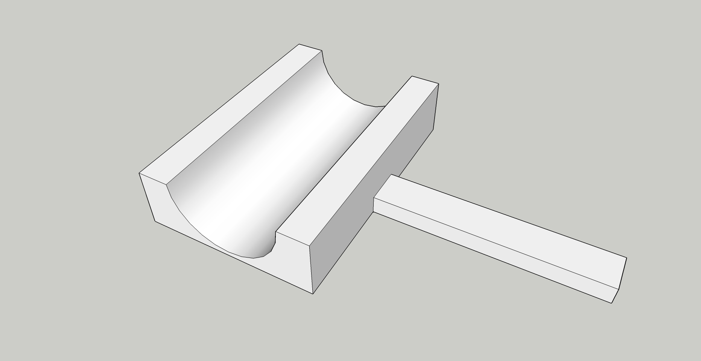
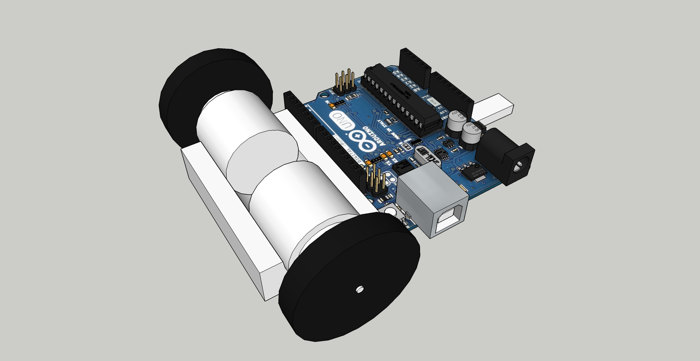

# Week 6

+ [Pirate Pad](http://piratepad.net/ep/pad/view/ro.B8MdXW-fXTZ/latest)

## Project 1: Chassis

+ We will be building simple electronic vehicles. The first step is to design a chassis that can support two DC motors.  The goal is to make something that works and that uses as little plastic filament as possible. In other words, keep your design to a minimum.

+ This project was inspired by this very simple ["soda can design" robot](http://www.ardumotive.com/can-robot-en.html). I discourage fully enclosed cylinders like this, but there are other aspects of the concept you can draw from. Notice it only has two wheels, and then a fin on the back that acts as a tripod to keep it standing.

+ I've included a SketchUp file with a digital replica of the DC motor we are going to use. I suggest you use it to construct your chassis.
	+ [dc-motor.skp](dc-motor.skp)
+ I've also included a PDF of the motor dimensions if you prefer to operate from that.
	+ [motor-specsheet.pdf](motor-specsheet.pdf)

+ This is intended to improve your SketchUp skills through practice. You should expect to run into several issues along the way. Persist! This will be a graded assignment. Your file should be 3d-printable, which means there should be no erroneous holes, and all of the normals (or faces) should be facing outwards.
	+ The following resources will help you
		+ [SketchUp official tutorials](https://www.sketchup.com/learn)
		+ [8 tips for 3d print designing in SketchUp](https://mastersketchup.com/8-tips-for-3d-printing-with-sketchup/)
		+ [unofficial sketchup for 3d modeling tutorial](https://www.youtube.com/watch?v=RPQliNKJKto)

+ Grading rubric:
	+ The design shouldn't use a massive amount of filament to print
	+ The design must take into account the dimensions of the motors
		+ Optionally, take into account an Arduino and/or breadboard in addition to the motors
		+ (Notice how my design lets the motors fit snug in the halfpipe)
	+ You should not include wheels in your final design
	+ Allow for two motors to be evenly placed in your design
	+ Model must be solid (ie no "holes")
	+ Faces/normals should be facing outward

+ I made a sketch of a plausible design, which you can feel free to work from:
	+ 
	+ 
	+ 
	+ 

### Examples of Arduino (and Raspberry Pi) vehicle chassis
+ https://www.thingiverse.com/thing:1582398
+ https://www.thingiverse.com/thing:1718473
+ https://www.thingiverse.com/thing:30196
+ https://www.thingiverse.com/thing:907392
+ https://www.thingiverse.com/thing:2606962
+ https://www.thingiverse.com/thing:2428526
+ https://www.thingiverse.com/thing:952520
+ https://www.thingiverse.com/thing:1679580
+ https://www.thingiverse.com/thing:2735218
+ https://www.thingiverse.com/thing:2662828 * favorite
+ https://www.thingiverse.com/thing:2800717 * favorite